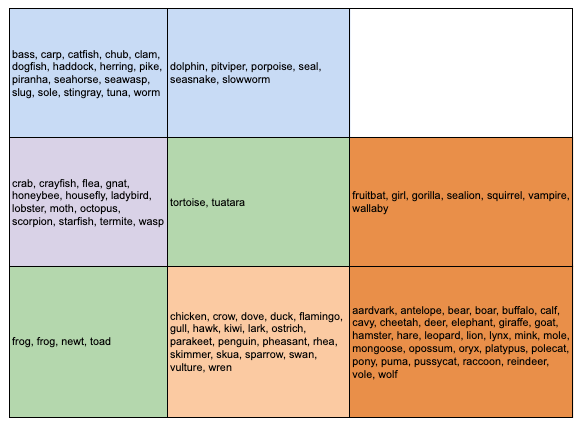

# Animals organization

## Dataset

A simple database containing 17 Boolean-valued attributes. The "type" attribute appears to be the class attribute.

[Zoo Data Set from UCI](https://archive.ics.uci.edu/ml/datasets/zoo)

## Output

## Dependencies

[Minison](https://github.com/JustGlowing/minisom/) - minimalistic and NumPy-based implementation of the Self Organizing Map